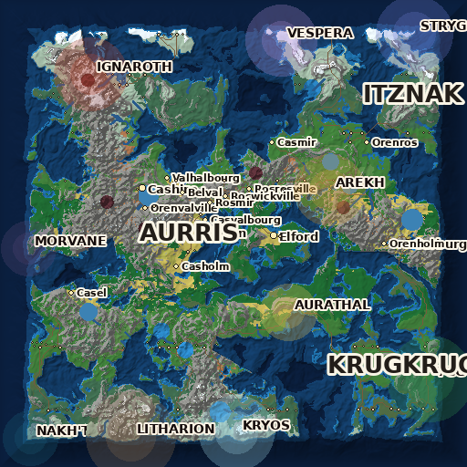

# NEXORIA — 01 · Carte du monde (ÉTAPE 2)

> Cartes générées par `python3 -m Gen3ia maps` — 2 048 px (32 m/pixel).

## Carte générale (biomes + relief + hydro + établissements + territoires)

## Lectures complémentaires

| Fichier | Contenu |
|---|---|
| `WorldData/maps/world_map_relief.png` | hypsométrie pure ombrée (mers → pics) |
| `WorldData/maps/world_map_political.png` | cultures, capitales, routes |
| `WorldData/maps/world_map_corruption.png` | emprises des 10 Suprêmes (rayon × 2,2) |
| `WorldData/maps/region_atlas.png` | grille 16×16 avec index de chaque région |

## Chiffres clés (voir 08_MOUNTAIN_DATABASE.md pour le détail)

- Terres émergées : ~46 % — 3 continents majeurs + ~30 îles et archipels
- 14 chaînes de montagnes identifiées (ceintures tectoniques), 6 volcans
- 86 fleuves/rivières dont ~14 fleuves majeurs, 5 lacs principaux
- 4 capitales, 12 bourgs, 42 villages, 70 hameaux, 75 routes (A*)
- 256 régions : 189 terrestres/côtières, 67 océaniques
- 10 territoires de Suprêmes — 36 régions exposées à une corruption

## Comment lire la carte

1. **Glaciers et toundras** au nord (latitudes +55°…+70°), jungle à
   l'équateur sud — les bandes de latitude gouvernent tout.
2. Les **déserts** se trouvent sous le vent des grandes chaînes (ombre
   pluviométrique, vents d'ouest).
3. Les **capitales** (points dorés) sont posées aux rencontres plaine/eau ;
   les routes les relient en évitant les reliefs (coût pente).
4. Les halos colorés marquent les territoires des **Suprêmes** : s'y
   approcher, c'est déjà entrer dans leur histoire.

## Légende des territoires (correspondances couleurs)

Voir `WorldData/supremes.json` (champ `corruption_color`) et
`Documentation/10_SUPREMES.md` pour la sémantique de chaque emprise.
